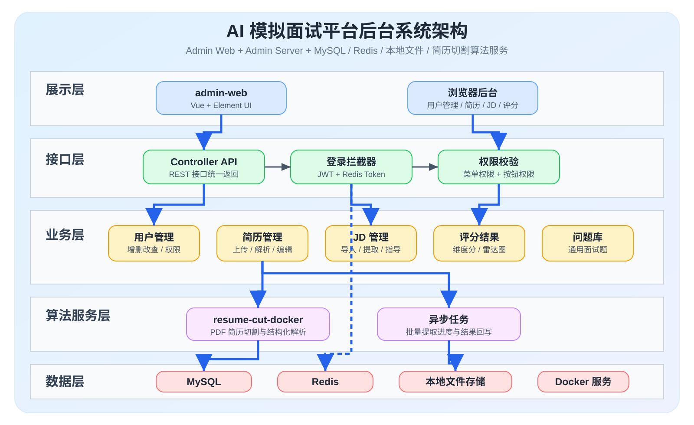
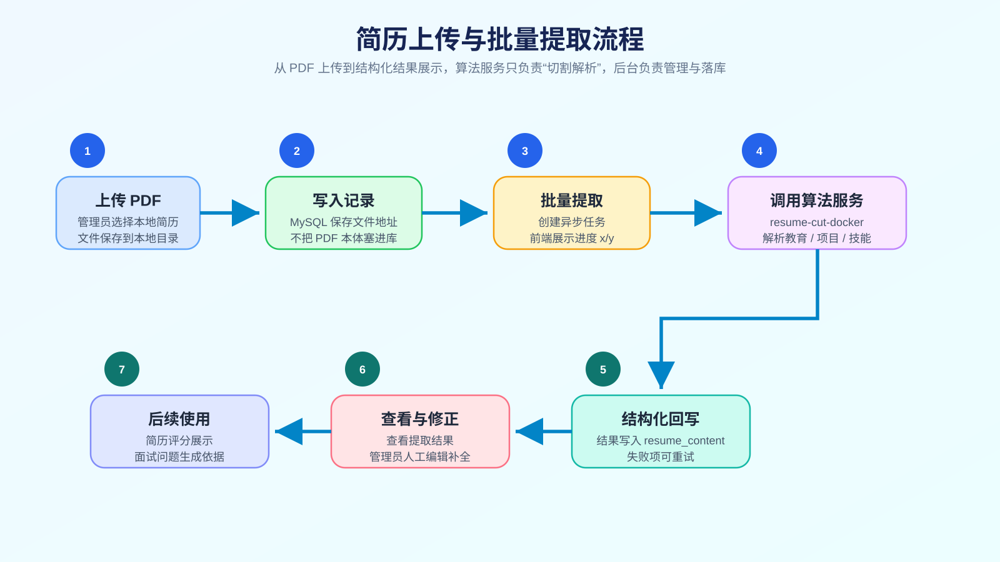
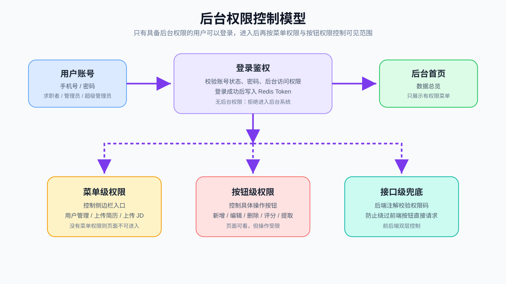
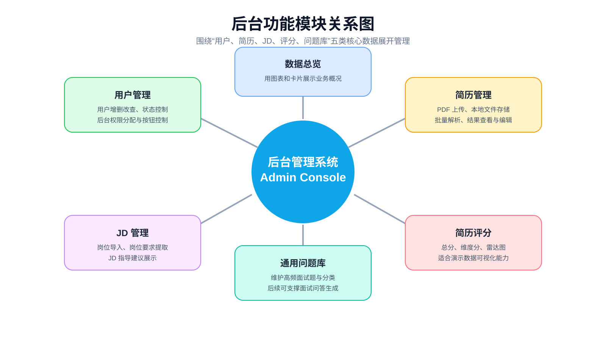
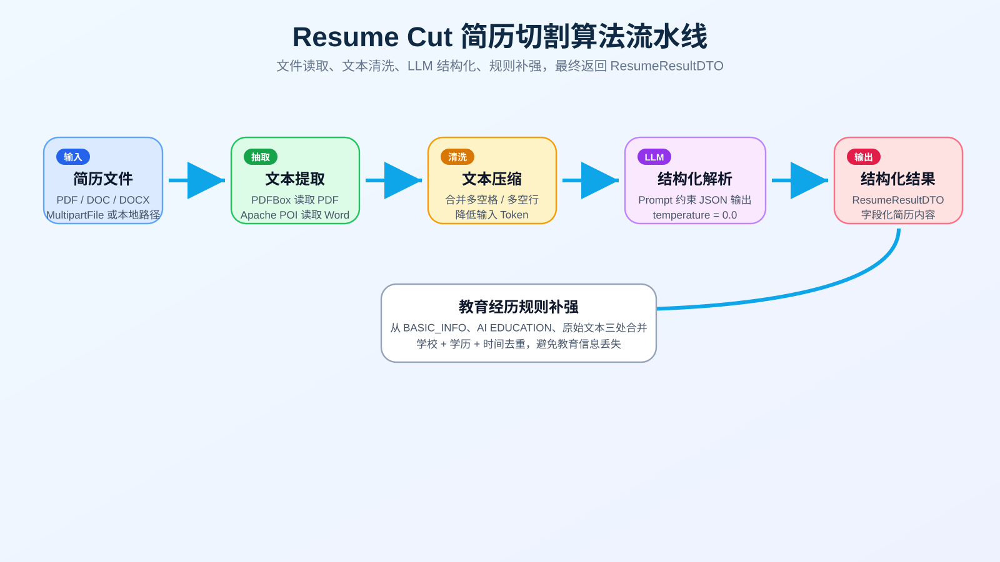
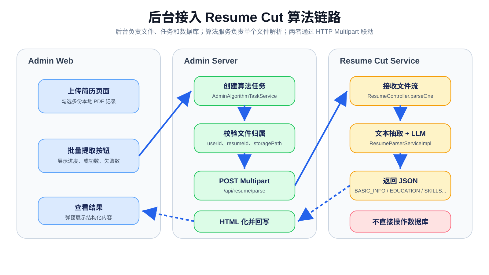
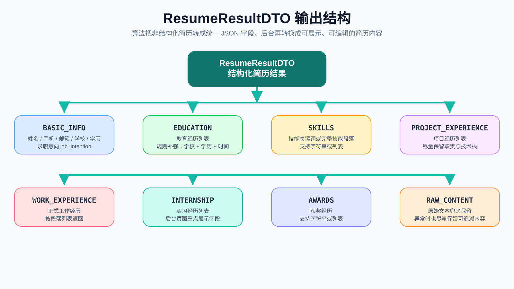
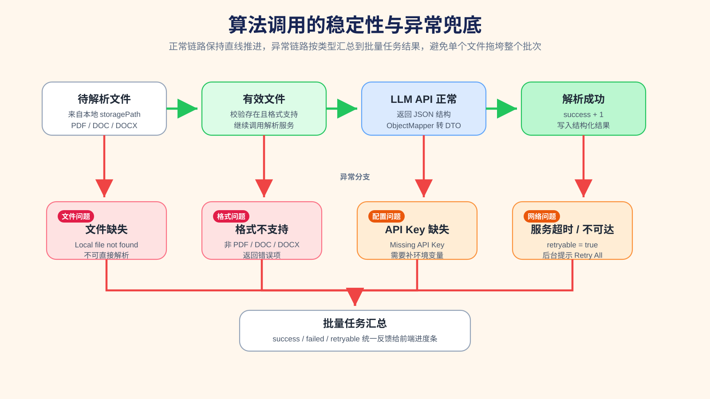

# 后台系统 PPT 素材包

> 交付对象：PPT 美工 / 视觉设计同学  
> 使用场景：校赛/答辩 PPT 中的“后台管理系统”部分  
> 素材范围：后台页面截图、系统结构图、算法流程图、权限模型图

---

## 1. 使用说明

素材已经按类型放在两个目录里：

| 类型 | 目录 | 用途 |
|---|---|---|
| 页面截图 | `docs/screenshots/` | 展示后台真实页面效果 |
| 矢量结构图 | `docs/ppt_assets/` | 展示系统架构、算法链路、权限模型 |

使用建议：

- 页面截图适合做功能展示页。
- SVG 结构图适合做架构页、流程页、算法说明页。
- SVG 是矢量图，放大不会糊，优先直接插入 PPT。
- 如果 PPT 不支持 SVG，可以用浏览器打开 SVG，再导出或截图成 PNG。
- 页面截图不建议整张铺满，可以配局部放大、箭头标注、模块说明卡片。

---

## 2. 后台系统定位

后台系统是本项目的管理端，主要面向管理员使用，负责统一管理用户、权限、简历、JD、评分结果和问题库。

一句话概括：

```text
后台管理系统用于统一管理用户权限、简历解析、JD 数据和面试辅助数据，为前台求职者体验提供数据支撑。
```

核心能力：

- 用户管理：用户增删改查、启用禁用、后台权限分配。
- 权限管理：后台登录控制、菜单级权限、按钮级权限、接口兜底校验。
- 简历管理：PDF 上传、本地文件存储、数据库保存文件地址。
- 简历解析：接入 Resume Cut 算法，批量提取简历结构化内容。
- 简历维护：查看解析结果，支持人工编辑和补全。
- 简历评分：展示简历评分结果、维度分和雷达图。
- JD 管理：导入岗位 JD，提取岗位要求，展示 JD 指导建议。
- 问题库管理：维护通用面试问题，作为后续面试问答能力的数据基础。

---

## 3. 推荐 PPT 页面结构

| 页码 | 页面主题 | 推荐素材 | 讲述重点 |
|---|---|---|---|
| 1 | 后台系统定位 | `04_admin_feature_map.svg`、`01_dashboard.png` | 后台承担管理端职责，统一管理核心业务数据 |
| 2 | 数据总览 | `01_dashboard.png` | 后台运营状态和核心数据一屏查看 |
| 3 | 用户与权限管理 | `02_user_management.png`、`03_user_permission_dialog.png`、`03_rbac_permission_model.svg` | 用户管理、后台权限、按钮级权限 |
| 4 | 简历上传与解析 | `04_resume_import.png`、`05_resume_batch_parse.png`、`02_resume_parse_flow.svg` | PDF 本地存储、批量解析、进度反馈 |
| 5 | Resume Cut 算法接入 | `05_resume_cut_algorithm_pipeline.svg`、`06_resume_cut_backend_integration.svg` | 后台如何调用算法服务，算法如何返回结构化结果 |
| 6 | 结构化结果与评分 | `06_resume_parse_result.png`、`07_resume_edit.png`、`08_resume_score.png`、`07_resume_cut_output_schema.svg` | 解析结果可查看、可编辑、可评分展示 |
| 7 | JD 与问题库管理 | `09_jd_import.png`、`10_jd_guide.png`、`11_general_questions.png` | 岗位数据和问题库管理能力 |
| 8 | 技术架构与稳定性 | `01_admin_system_architecture.svg`、`08_resume_cut_error_retry.svg` | 前后端、数据库、Redis、文件存储、算法服务协作 |

---

## 4. 页面截图素材

截图目录：

```text
docs/screenshots/
```

### 4.1 数据总览

文件：`01_dashboard.png`

用途：展示后台首页、核心数据卡片、后台整体运营概况。


---

### 4.2 用户管理

文件：`02_user_management.png`

用途：展示用户列表、状态、标签、权限入口和操作按钮。


---

### 4.3 权限分配弹窗

文件：`03_user_permission_dialog.png`

用途：展示管理员为用户分配后台权限、按钮级权限的配置能力。


---

### 4.4 上传简历

文件：`04_resume_import.png`

用途：展示简历列表、本地文件状态、上传入口和当前查看用户。


---

### 4.5 批量提取

文件：`05_resume_batch_parse.png`

用途：展示批量提取成功提示、选中简历、本地文件可提取状态。


---

### 4.6 查看提取结果

文件：`06_resume_parse_result.png`

用途：展示 Resume Cut 算法提取出的结构化简历内容。


---

### 4.7 修改简历

文件：`07_resume_edit.png`

用途：展示解析后的简历内容支持人工维护、编辑和补全。


---

### 4.8 简历评分

文件：`08_resume_score.png`

用途：展示简历评分列表、总分、维度分和雷达图效果。


---

### 4.9 上传 JD

文件：`09_jd_import.png`

用途：展示岗位 JD 列表、岗位类型、城市、薪资、岗位描述和要求。


---

### 4.10 JD 指导建议

文件：`10_jd_guide.png`

用途：展示根据 JD 生成或整理出的岗位准备建议、面试提示等内容。


---

### 4.11 通用问题库

文件：`11_general_questions.png`

用途：展示后台维护通用面试问题的能力。


---

### 4.12 补充素材：上传文件队列

文件：`extra_resume_upload_queue.png`

用途：如果需要展示上传过程，可以作为补充图使用。


---

## 5. 矢量结构图素材

素材目录：

```text
docs/ppt_assets/
```

| 文件名 | 建议使用位置 | 说明 |
|---|---|---|
| `01_admin_system_architecture.svg` | 技术架构页 | 后台系统总体架构 |
| `02_resume_parse_flow.svg` | 简历解析流程页 | 简历上传、批量提取、结果回写流程 |
| `03_rbac_permission_model.svg` | 权限管理页 | 登录鉴权、菜单权限、按钮权限 |
| `04_admin_feature_map.svg` | 后台模块总览页 | 后台核心功能模块关系 |
| `05_resume_cut_algorithm_pipeline.svg` | 算法原理页 | Resume Cut 算法内部流水线 |
| `06_resume_cut_backend_integration.svg` | 后台算法接入页 | 后台如何调用算法服务 |
| `07_resume_cut_output_schema.svg` | 结构化结果页 | ResumeResultDTO 输出字段结构 |
| `08_resume_cut_error_retry.svg` | 稳定性说明页 | 异常兜底与失败重试机制 |

### 5.1 后台系统总体架构

文件：`01_admin_system_architecture.svg`



---

### 5.2 简历上传与批量提取流程

文件：`02_resume_parse_flow.svg`



---

### 5.3 后台权限控制模型

文件：`03_rbac_permission_model.svg`



---

### 5.4 后台功能模块关系图

文件：`04_admin_feature_map.svg`



---

### 5.5 Resume Cut 算法内部流水线

文件：`05_resume_cut_algorithm_pipeline.svg`



---

### 5.6 后台接入 Resume Cut 算法链路

文件：`06_resume_cut_backend_integration.svg`



---

### 5.7 ResumeResultDTO 输出字段结构

文件：`07_resume_cut_output_schema.svg`



---

### 5.8 算法异常兜底与重试机制

文件：`08_resume_cut_error_retry.svg`



---

## 6. 算法说明口径

Resume Cut 算法的作用不是最终评分，而是把 PDF / Word 简历解析成结构化字段。

算法链路：

```text
PDF / Word 简历
-> PDFBox / POI 抽取文本
-> 清洗空格和空行
-> 调用 LLM 输出 JSON
-> 规则补强教育经历
-> 返回 ResumeResultDTO
-> 后台转成 HTML
-> 写入 resume_content
```

可以在 PPT 里这样讲：

```text
后台系统将用户上传的简历文件保存到本地，并在数据库中保存文件地址。管理员发起批量提取后，后台创建异步任务，逐份调用 Resume Cut 算法服务。算法服务负责从 PDF 或 Word 中抽取文本，并通过 LLM 解析为结构化字段，最终由后台写入 resume_content，供查看、编辑和评分展示使用。
```

---

## 7. 权限说明口径

后台不是所有用户都能登录，只有具备后台权限的账号可以进入。

权限分为三层：

| 层级 | 作用 |
|---|---|
| 登录鉴权 | 判断账号是否具备后台访问权限 |
| 菜单权限 | 控制用户能看到哪些后台菜单 |
| 按钮权限 | 控制用户能否执行新增、编辑、删除、提取、评分等具体操作 |

可以在 PPT 里这样讲：

```text
后台系统采用登录鉴权、菜单权限、按钮权限结合的方式控制管理边界。用户登录时先判断是否具备后台访问资格，进入后台后再根据权限决定可见菜单和可操作按钮，同时后端接口也会进行权限兜底校验。
```

---

## 8. 设计建议

整体风格建议：

- 颜色保持蓝色、青绿色、浅灰白为主，贴合后台系统和科技感。
- 页面截图可以加轻微阴影、圆角外框，避免直接平铺显得单薄。
- 结构图建议作为单独页面主视觉，旁边放 2-3 条短文案。
- 算法相关图可以用“输入 -> 处理 -> 输出”的叙事方式呈现。
- 权限图可以强调“不是所有用户都能进入后台”。
- 简历解析页建议重点突出“本地存文件、数据库存地址、算法提取结构化结果”。

不建议：

- 不要把所有截图挤在同一页。
- 不要使用过多长段文字。
- 不要把 SVG 截成低清图后再放大。
- 不要在页面里保留浏览器地址栏，除非需要展示真实运行环境。

---

## 9. 可直接使用的短文案

后台系统总览：

```text
面向管理员的后台管理端，统一承载用户权限、简历解析、JD 管理和面试数据维护。
```

用户权限：

```text
通过登录鉴权、菜单权限和按钮权限，保证不同角色拥有清晰的后台操作边界。
```

简历解析：

```text
简历文件保存在本地，数据库保存文件地址，后台调用 Resume Cut 算法完成结构化提取。
```

算法接入：

```text
Resume Cut 算法负责从 PDF / Word 中抽取文本，并输出可落库、可展示、可编辑的结构化简历字段。
```

评分展示：

```text
简历评分结果通过总分、维度分和雷达图展示，便于管理员快速判断简历质量。
```

JD 与问题库：

```text
后台统一维护岗位 JD、岗位指导建议和通用面试问题，为后续模拟面试流程提供数据基础。
```

---

## 10. 文件检查清单

主截图已准备：

| 文件 | 状态 |
|---|---|
| `01_dashboard.png` | 已准备 |
| `02_user_management.png` | 已准备 |
| `03_user_permission_dialog.png` | 已准备 |
| `04_resume_import.png` | 已准备 |
| `05_resume_batch_parse.png` | 已准备 |
| `06_resume_parse_result.png` | 已准备 |
| `07_resume_edit.png` | 已准备 |
| `08_resume_score.png` | 已准备 |
| `09_jd_import.png` | 已准备 |
| `10_jd_guide.png` | 已准备 |
| `11_general_questions.png` | 已准备 |

结构图已准备：

| 文件 | 状态 |
|---|---|
| `01_admin_system_architecture.svg` | 已准备 |
| `02_resume_parse_flow.svg` | 已准备 |
| `03_rbac_permission_model.svg` | 已准备 |
| `04_admin_feature_map.svg` | 已准备 |
| `05_resume_cut_algorithm_pipeline.svg` | 已准备 |
| `06_resume_cut_backend_integration.svg` | 已准备 |
| `07_resume_cut_output_schema.svg` | 已准备 |
| `08_resume_cut_error_retry.svg` | 已准备 |
