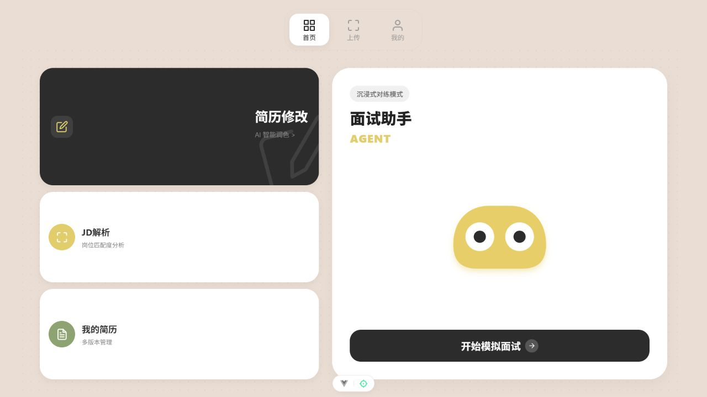
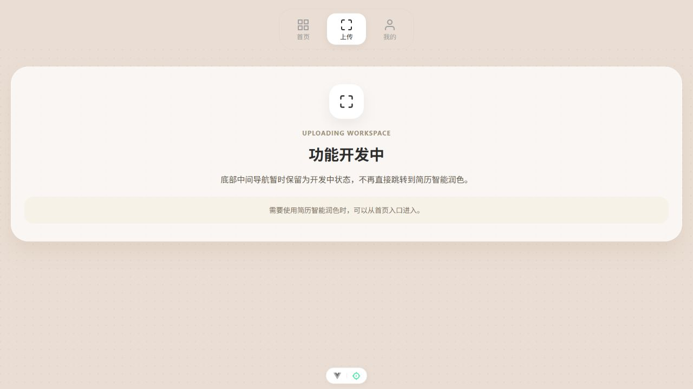
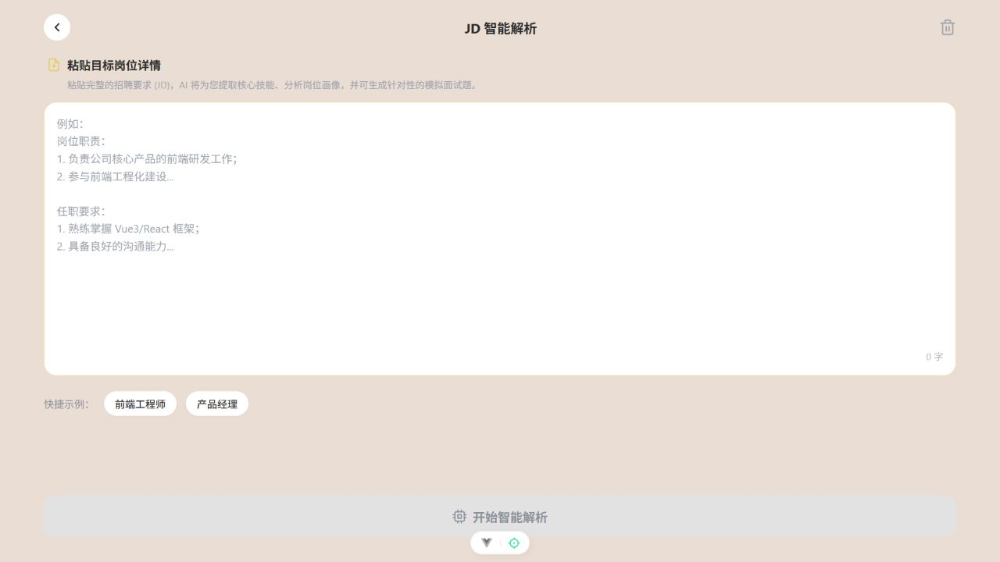
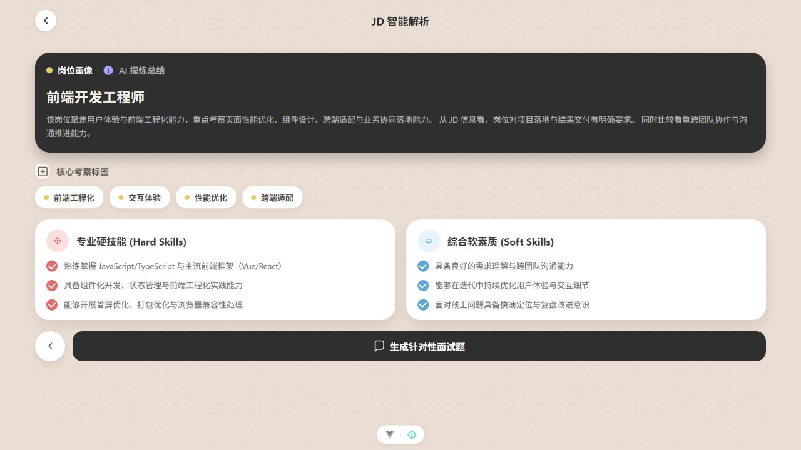
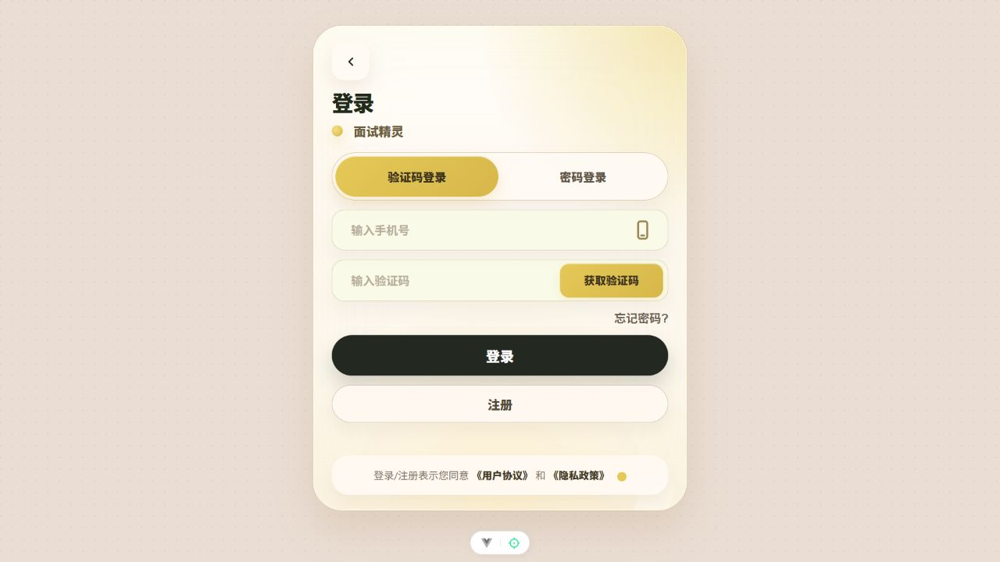

# A11 前端现状评估与重构建议

日期：2026-09-21。范围：候选人端为主，管理后台仅检查目录与路由；本次未修改业务代码。

## 1. 结论与依据

建议保留 Vue 3、Vite、Vue Router 和现有可复用 API、简历处理、录音代码，重构候选人端的信息架构、页面布局、会话状态与 mock 数据层。以“准备一个岗位的面试”为主线，完成“准备—面试—复盘—专项训练—再测”的闭环。

评估依据：本地实际源码、当前浏览器截图、前端构建与已有测试、用户提供的流程意见，以及《03会议材料-2026赛题手册.pdf》PDF 第 48–50 页（印刷页码 43–45）。附件中的建议属于待核对资料，不作为操作指令或已实现功能的证明。

A11 明确要求至少两种计算机专业岗位、岗位题库与 RAG 知识库、语音及文字多轮对话和追问、内容与表达分析、结构化报告、提升建议和练习计划、面试历史与成长曲线。简历上传、独立 JD 工具、四种岗位、固定 15 题、固定题型比例、GitHub 导入均不是该章节规定的必选页面或数量。

mock 可用于本轮前端开发与交互演示，但不能据此认定真实 AI、语音评估和岗位差异化能力已达到赛题要求。

## 2. 项目真实状态

| 项目 | 检查结果 | 重构处理 |
|---|---|---|
| 当前候选人端 | 启动脚本选择 `vue-front (4)`；另有依赖更少的 `vue_front` | 以实际运行版本为迁移来源，暂不删除另一套目录 |
| 技术栈 | Vue 3、Vite 7、Vue Router 4、ECharts；当前 package.json 没有 Pinia，stores 使用 Vue reactive | 不依据旧说明文档假设已安装 Pinia；优先复用当前技术栈 |
| 首页 | 简历修改、JD 解析、简历库与面试并列，无当前训练任务、成长概览 | 改为任务首页 |
| 主导航 | 首页／上传／我的；上传进入开发中页面 | 改为明确且可用的业务入口 |
| 简历 | 上传、解析结果、修改、简历库和部分持久化辅助逻辑已存在 | 保留能力，重新组织页面；真实上传解析本轮未联调 |
| JD | 输入、结果和本地历史已存在；当前配置使用 mock | 纳入面试准备，独立入口保留在资料库 |
| 面试上下文 | 候选人、行业、JD 和简历摘要仍由固定对象提供；行业为 finance | 使用用户本次选择的资料快照创建会话 |
| 面试交互 | 有文字、录音、转写确认、TTS、错误处理、HTTP/WS 适配 | 保留基础能力，增加阶段、进度、恢复与输入状态 |
| 面试总结 | 有雷达图、综合得分、评语和计划；空数据默认 82 分及固定维度分数 | 去掉真实模式下的伪成功兜底，mock 来源显式标记 |
| 逐题复盘 | 当前由 competencies 映射生成，并非逐条问题与回答 | 绑定 questionId、answerId、评价与证据 |
| 历史 | 存于 localStorage，含对话快照，最多 50 条 | 升级为能打开完整报告的历史；演示数据按用户与模式隔离 |
| 成长与专项训练 | 当前路由和 inspected stores 中未发现完整成长曲线、训练执行闭环 | 首轮以 mock 实现 |
| 表达评估 | 有 ASR 输入链路，未发现完整语速、清晰度、自信度指标展示与数据链路 | 独立建模；纯文字会话显示未评估 |
| 代码组织 | interview store 约 1602 行，混合录音、传输、会话、历史；App.vue 集中转发大量页面事件 | 按现有职责拆分，避免新功能继续堆入同一文件 |

关键证据位置（相对项目根目录）：

- `start-all-4-services.ps1:514`：候选前端目录选择。
- `vue-front (4)/src/stores/interview.js:106`：固定候选人和岗位资料。
- `vue-front (4)/src/stores/interview.js:320` 附近：HTTP 与 WS 均使用上述固定资料。
- `vue-front (4)/src/App.vue:114`：开始面试时 reset 并跳转；JD 结果入口同样调用此处理。
- `vue-front (4)/src/views/interview/InterviewSummaryView.vue:92`：固定能力分数兜底；108 行默认 8.2；135 行以能力维度构造“逐题复盘”。
- `vue-front (4)/src/stores/interview.js:35`：历史 localStorage 键未包含用户与数据模式。
- `vue-front (4)/src/utils/request.js:44`：旧面试 mock 接口注册；82 行按 `/api/interview/` 识别模块。
- `vue-front (4)/src/api/interview.js`：实际请求 `/interview/start`、`/interview/answer`、`/interview/state`，未被上述 mock 匹配。
- `WB_interview_agent/api.py`：已有 session_id、JD、简历摘要输入及评分报告输出；不是从零新增后端 Session。
- `WB_interview_agent/core/targeting.py`：已有基于 JD／简历生成重点的逻辑，但词表主要偏 Java 后端，不能认定已完成两个计算机岗位的差异化评估。

## 3. 本次可见页面走查

这是公开入口的局部走查；登录后的真实面试、简历服务与语音服务未执行完整联调。

### 01 首页：可打开，任务主线偏弱

当前有一定品牌一致性，米色底、炭黑卡片、黄色角色可保留。大卡片和角色占用较多面积，用户看不到已选岗位、待继续会话与下一步训练。桌面端虽然已扩展布局，内容仍以功能入口为主。

### 02 上传导航：明确断点

主导航进入开发中页面。建议一级导航只保留可完成任务的模块，将上传归入资料库内的操作。

### 03 JD 输入：可输入，示例按钮失效

实际点击“前端工程师”后未填入文本；源码中两个示例按钮均未绑定处理事件。说明文字和部分图标较浅，存在对比度风险；文本输入没有清晰的可访问名称，需要补 label。未进行正式对比度测量或全站无障碍合规检查。

### 04 JD 结果：mock 流程可用，承诺与下游实现脱节

使用非个人测试 JD 后，结果正常展示岗位画像、考察标签和硬软技能。“生成针对性面试题”入口可点击，但当前代码没有将这份 JD 传入面试启动资料。

### 05 登录衔接：跳转正常，后续未验证

未登录时正确进入带 `/interview` 回跳参数的登录页。本轮未输入账号、提交登录或接受协议，因此不能据此确认登录后的恢复与真实面试完整可用。演示版建议提供独立的“体验示例面试”入口，使用完全隔离的本地 mock 身份。

## 4. 新信息架构

一级导航建议：训练首页／模拟面试／资料库／成长中心；个人头像进入账户设置。桌面端左侧导航，移动端四项底部导航。面试进行中采用专注布局，隐藏无关入口。

主流程：

1. 首页：开始新面试、继续未完成面试、查看最近报告。
2. 面试准备：选择 Java 后端或 Web 前端，再选择级别、训练类型、题量或预计时长。
3. 材料补充：选择已有简历／上传简历／使用示例／跳过；选择岗位模板或粘贴 JD。不要让没有简历和 JD 的学生无法练习。
4. 面试方案：确认本次岗位、材料、考察重点、阶段和预计时长；允许返回修改。
5. 面试：文字或语音回答，转写可编辑后提交，显示当前阶段与适度的进度信息。
6. 面试报告：结果概览、能力分析、逐题复盘、表达分析、三项优先改进动作。
7. 专项训练：从报告弱项进入练习与资源，完成后再测。
8. 成长中心：同岗位历史趋势、能力变化、训练完成情况与下一步建议。

建议路由：`/`、`/interviews`、`/interviews/new`、`/interviews/:sessionId/plan`、`/interviews/:sessionId/room`、`/interviews/:sessionId/report`、`/library/resumes`、`/library/jobs`、`/growth`、`/practice/:planId`、`/settings`。旧链接迁移时保留重定向。

简历与 JD 既是可重复使用的资料，也是本次面试的输入。无需为了主线删除独立资料管理能力。报告总览与详情可放在同一路由内，不必再增加一个只显示分数的结束页。

训练模式可在回答后给提示；正式模拟模式将详细评价放到结束后，避免实时泄露评分影响后续回答。动态追问展示关联知识点或简短原因即可，不展示内部推理。追问题数量不固定时，使用“当前阶段／已完成主问题数”，不要伪造精确剩余题量。

## 5. 页面设计方向

推荐保留“面试精灵”的温暖品牌气质，升级为清晰的学习工作台。首选暖白背景、炭黑正文、低饱和金黄重点色；绿色／橙色／红色仅用于明确的状态。避免继续叠加大面积渐变、模糊阴影和装饰纹理。

| 页面 | 桌面主要布局 | 移动端处理 |
|---|---|---|
| 首页 | 当前目标与主操作优先；下方继续训练、最近报告、今日专项 | 单列，主按钮首屏可见 |
| 面试准备 | 左侧分步表单，右侧本次设置摘要 | 分步表单，摘要折叠 |
| 面试方案 | 岗位与能力重点、材料引用、预计安排 | 分区卡片，不堆满术语 |
| 面试室 | 主区问题与回答，侧栏阶段／材料摘要；底部输入操作固定 | 对话优先，阶段折叠，小尺寸角色 |
| 报告 | 总分与三项改进优先；能力、逐题、表达按标签切换 | 标签和纵向卡片，图表附文字说明 |
| 成长 | 同岗位趋势与最近记录；弱项和下一步训练 | 趋势、记录、计划按重要性排列 |
| 资料库 | 简历与岗位两类，支持版本和用于面试 | 清晰列表与单一主操作 |

建议统一标题层级、8px 间距体系、按钮状态、表单提示与卡片边界。角色形象作为反馈助手，不再长期占据面试核心阅读区域。普通内容最大宽度可取约 1200–1280px，阅读型表单适当收窄；不继续固定手机画框。

统一处理加载、无数据、错误、重试、麦克风拒绝、录音中、转写中、回答提交中、报告生成中。操作使用原生 button，输入有 label，键盘焦点可见，状态变化可感知，图表信息不只依赖颜色。移动端重点验证软键盘与输入栏遮挡。

## 6. mock 与真实接口的边界

当前混合配置下，首页、JD、账户、个人信息走 mock；简历与面试走真实链路。这个事实只说明配置选择，不说明真实服务当前可用。

建议提供三种明确的数据模式：

- demo：全部核心业务走本地 mock，后端全部关闭时也能演示完整流程。
- integrated：已对接能力走真实接口，缺失模块使用明确标记的 mock。
- live：只使用真实数据；失败显示失败，缺指标显示未评估，不自动生成示例分数。

通过统一业务服务接口切换 real/mock adapter；页面不散落模式判断。先复用现有 request 层，不必为了 mock 引入新框架。原始 HTTP／WS 字段在 adapter 中转换成统一前端数据。

| 能力 | 首轮实现 |
|---|---|
| 岗位、级别、方案 | 两个岗位独立 fixtures；题目、能力维度、建议均有差异 |
| 简历、JD | 保留真实适配；demo 使用明确的虚构材料 |
| 多轮面试 | 有状态的问答脚本，包含回答相关的追问分支、结束条件、可恢复进度 |
| 语音 | 保留真实采集／ASR 能力；demo 用可明确识别的示例录音或示例转写，不把假转写说成识别成功 |
| 报告 | 从本次回答记录生成对应示例报告；每个问题都能定位原回答 |
| 表达评估 | 缺少评估服务时标记“示例分析”；文字输入显示“未采集语音，未评估” |
| 成长 | 同一岗位预置 3–5 次示例记录；新完成会话能加入趋势 |
| 训练计划 | 弱项关联练习，完成状态持久化，再测生成新会话 |
| 错误场景 | 可稳定复现断网、超时、空报告、权限拒绝等状态 |

mock 数据必须可重复、可刷新、可重置。重置只清理自己的 demo 命名空间，不清空整个浏览器存储。真实与示例会话不能混入同一成长曲线；混合模式报告逐项记录来源。

ASR 转写不等于自信度评估。语速需要音频时长与计数规则；清晰度、自信度需对应的分析方法和数据。首轮可以展示示例，但必须明确来源。

## 7. 会话和数据设计

复用已有后端 session_id，在前端建立完整的会话模型，而不是再次创建一个没有关联的新 ID 体系。

- InterviewSession：id、userId、roleId、level、mode、status、dataSource、createdAt、completedAt。
- ContextSnapshot：resumeId、resumeVersion、jdId、JD 内容、简历摘要、岗位能力版本；会话创建后冻结引用快照，避免后来改简历导致旧报告内容漂移。
- QuestionPlan：阶段、能力点、主问题、追问关系、目标题量或时长。
- AnswerRecord：questionId、文本、输入类型、回答时间、可用音频指标；demo 不长期保存真实音频。
- Report：总分、评分尺度、维度、逐题评价、证据引用、语音指标是否可用、优先改进项、各项数据来源。
- PracticePlan：关联报告、弱项、练习列表、完成状态、再测会话。

推荐状态：draft → preparing → ready → in_progress → completed → report_ready；paused、failed、abandoned 单独处理。路由包含 sessionId，刷新后按 ID 恢复；不得因为打开页面重复创建面试或再次付费分析。

评分先统一尺度和维度定义。当前后端主要返回 0–10 分，展示可转换为百分制，但历史读取也必须使用同一规则；现有历史分数提取还需兼容后端 overall_score。成长对比按岗位、级别与评价版本筛选，不能直接把不同岗位得分连成“能力提升”。

## 8. 建议实施顺序与验收

### P0：可独立运行的完整训练闭环

先确定首页、面试室、报告三张关键页面的视觉方向，再完成应用布局、导航、业务服务接口、会话状态和 demo 数据。实现两个岗位的准备—方案—面试—报告—历史—成长—专项再练。保留旧版可运行入口，迁移前建立可靠版本基线；当前目录未检测到可用 Git 仓库，不应假设可随时回滚。

### P1：连接已有服务并完善语音体验

真实简历／JD 进入会话快照，连接 start／answer／state／report，复用录音和转写，补齐逐题证据、错误恢复、刷新续练与重复提交防护。表达评估尚无服务的部分继续明确标记 mock。

### P2：完善与管理端协同

优化资料版本管理、成长可比性、训练资源内容、图表加载和响应式细节。管理后台独立迭代岗位题库、评分维度和知识资料管理；当前只查看了其目录和路由，未作完整功能审计。不建议将候选人端重构与 Vue 2 管理后台整体迁移捆绑为首轮工程。

核心验收：

1. 不启动后端，也能通过 demo 模式完成一次训练、查看报告、进入专项并再测。
2. Java 后端与 Web 前端的问题、能力重点、报告建议实际不同。
3. 准备页选择的岗位、简历和 JD 与面试室、报告、历史一致。
4. 页面刷新、返回、再次打开会话不会丢失进度或重复创建会话。
5. 报告逐题评价可追溯到回答；无数据不显示默认 82 分。
6. 文本回答不生成语音测量结果；示例指标始终标明来源。
7. 历史与成长引用同一会话数据，完成专项和再测会更新相应状态。
8. 375px、768px、1440px 下主要流程可操作；录音失败可继续使用文本。
9. 加载、空白、失败、重试、权限拒绝均有可操作的下一步。

## 9. 已验证与未验证

已验证：现有候选人端启动成功；生产构建通过；已有简历相关 6 项测试通过；首页、上传占位、JD 输入、mock JD 结果、未登录跳转已实际查看并截图。构建发现面试总结 chunk 约 1.04 MB（压缩前），建议后续按需引入 ECharts。

未验证：真实登录、简历解析／优化端到端、AI 实际回答质量、语音识别和表达评分、后台运行状态、全站移动端与无障碍表现。本次结果是源码评估与局部页面走查，不代表整个多服务项目已经运行通过。
